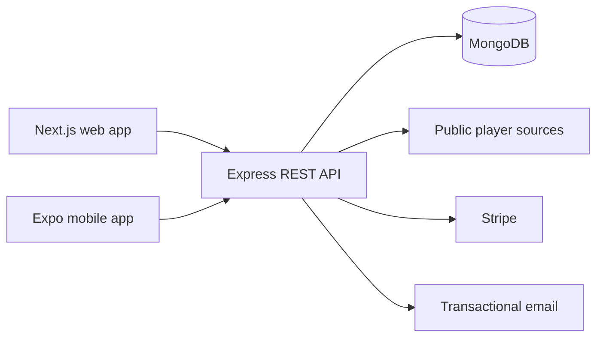

# MJD Football Scout

**A full-stack football scouting and recruitment workspace for discovering players, comparing profiles, building shortlists, planning future squads, and managing recruitment decisions.**

[Live web app](https://mjd-football-scout.vercel.app) · [Production API](https://mjd-football-server.onrender.com) · [Changelog](CHANGELOG.md) · [Shadow Team guide](docs/SHADOW_TEAM.md) · [Recruitment Workspace guide](docs/RECRUITMENT_WORKSPACE.md)

## Overview

MJD Football Scout brings player intelligence and recruitment planning into one responsive application. It collects player information from public football sources, normalizes the data in a TypeScript API, and turns it into practical workflows for scouts and recruitment teams.

The monorepo contains:

- a Next.js web application for scouting and recruitment workflows;
- an Express REST API for authentication, player data, analytics, billing, and persistence;
- an Expo mobile client that consumes the same API;
- feature documentation and release notes.

## Product highlights

| Area                  | Capabilities                                                                                                                                                                 |
| --------------------- | ---------------------------------------------------------------------------------------------------------------------------------------------------------------------------- |
| Player discovery      | Search public sources, browse the player database, apply advanced filters, and inspect highlights and statistics.                                                            |
| Player intelligence   | Review profiles, ELO, market value, attributes, transfers, titles, history, and similar-player recommendations.                                                              |
| Comparison            | Compare selected players or rank the full database using consistent metrics.                                                                                                 |
| Watchlists            | Create reusable lists, add or remove players, and control shortlist order.                                                                                                   |
| Scouting reports      | Record ratings, decisions, strengths, weaknesses, and notes for individual players.                                                                                          |
| Shadow Team           | Build a `4-3-3`, `4-2-3-1`, `4-4-2`, or `3-5-2`; manage positional shortlists; identify gaps and duplicate assignments; and review squad metrics.                            |
| Recruitment Workspace | Move candidates through seven stages, assign ownership and deadlines, create evaluation templates, plan replacements, save searches, and calculate club-specific fit scores. |
| Accounts and security | Use credentials or Google sign-in, email verification, password recovery, TOTP MFA, recovery codes, notification preferences, and reversible account deactivation.           |
| Premium               | Unlock recruitment workflows through Stripe Checkout, webhook-synchronized access, and the Stripe Customer Portal.                                                           |

## Architecture



All private API routes use bearer access tokens. User-owned resources are scoped by the authenticated user ID, while administrative actions are protected by role checks. Shadow Team and Recruitment Workspace additionally require an active Premium subscription or administrator access.

## Technology stack

### Web

- Next.js 16 with the App Router
- React 19 and TypeScript
- TanStack Query and Axios
- NextAuth with credentials and Google OAuth
- Tailwind CSS 4 and Radix UI primitives
- Zod runtime validation

### API

- Node.js 24, Express 5, and TypeScript
- MongoDB native driver
- Cheerio-based player extraction
- JWT access and refresh tokens
- Zod validation, Helmet, CORS, and compression
- Winston request and application logging
- Stripe subscriptions and transactional email integration

### Mobile

- Expo 54 and Expo Router
- React Native 0.81
- Shared REST API and JWT authentication

## Repository structure

```text
.
├── server/       Express API, authentication, scraping, and persistence
├── web-app/      Next.js web application and shared UI system
├── mobile-app/   Expo and React Native client
├── docs/         Feature and technical documentation
└── CHANGELOG.md  Product release history
```

## Prerequisites

- Node.js 24 recommended; Node.js 20 or newer supported
- npm or pnpm
- MongoDB running locally or through MongoDB Atlas
- Optional integrations:
  - Google OAuth credentials
  - Stripe test-mode credentials
  - Resend API key or another configured email provider

## Local development

### 1. Clone and install

```bash
git clone git@github.com:mahmoudjd/MJD-Footballscout.git
cd MJD-Footballscout

cd server && npm install
cd ../web-app && npm install
cd ../mobile-app && npm install
```

### 2. Create local environment files

```bash
cp server/.env.development.local.example server/.env.development.local
cp web-app/.env.development.local.example web-app/.env.development.local
```

The checked-in examples are safe templates. Replace placeholder secrets before starting the applications.

### 3. Start MongoDB

The default local backend template expects MongoDB at:

```text
mongodb://127.0.0.1:27017/MJD_FootballScout_Local
```

You can replace `MONGOURI` with an Atlas connection string instead.

### 4. Start the API and web app

Use two terminals:

```bash
# Terminal 1
cd server
npm run dev:local
```

```bash
# Terminal 2
cd web-app
npm run dev:local
```

Open [http://localhost:3002](http://localhost:3002). The API runs at [http://localhost:8080](http://localhost:8080).

### 5. Start the mobile app (optional)

```bash
cd mobile-app
npm start
```

## Environment variables

### Backend

Configure `server/.env.development.local` for local development and production environment variables in the hosting platform.

| Variable                             | Required        | Purpose                                                        |
| ------------------------------------ | --------------- | -------------------------------------------------------------- |
| `MONGOURI`                           | Yes             | MongoDB connection string.                                     |
| `JWT_SECRET`                         | Yes             | Signs API access and refresh tokens. Use a long random secret. |
| `CLIENT_URL`                         | Production      | Exact web origin allowed by CORS.                              |
| `PORT`                               | No              | API port; defaults to `8080`.                                  |
| `GOOGLE_CLIENT_ID`                   | Google login    | Accepted Google OAuth audience or comma-separated audiences.   |
| `RESEND_API_KEY`                     | Email delivery  | Sends verification, password recovery, and security emails.    |
| `EMAIL_FROM`                         | Email delivery  | Verified sender identity.                                      |
| `MFA_ENCRYPTION_KEY`                 | MFA             | Encrypts stored TOTP secrets. Generate a 32-byte key.          |
| `STRIPE_SECRET_KEY`                  | Premium billing | Stripe secret key.                                             |
| `STRIPE_WEBHOOK_SECRET`              | Premium billing | Verifies Stripe webhook signatures.                            |
| `STRIPE_PREMIUM_PRICE_ID`            | Premium billing | Recurring monthly Premium price ID.                            |
| `PLAYERS_AUTO_UPDATE_ENABLED`        | No              | Enables scheduled player refreshes.                            |
| `PLAYERS_AUTO_UPDATE_INTERVAL_HOURS` | No              | Scheduler interval; defaults to 12 hours.                      |

### Web app

Configure `web-app/.env.development.local` locally and the equivalent variables in Vercel.

| Variable                            | Required   | Purpose                                                                                    |
| ----------------------------------- | ---------- | ------------------------------------------------------------------------------------------ |
| `NEXT_PUBLIC_API_HOST`              | Yes        | Public base URL of the Express API.                                                        |
| `NEXTAUTH_URL`                      | Production | Canonical URL of the web application.                                                      |
| `NEXTAUTH_SECRET`                   | Yes        | Encrypts and signs NextAuth session data.                                                  |
| `GOOGLE_CLIENT_ID`                  | Yes        | Google OAuth web client ID; use the local placeholder to disable Google login locally.     |
| `GOOGLE_CLIENT_SECRET`              | Yes        | Google OAuth web client secret; use the local placeholder to disable Google login locally. |
| `NEXT_PUBLIC_ADSENSE_ENABLED`       | No         | Enables configured free-tier advertising.                                                  |
| `NEXT_PUBLIC_ADSENSE_CONSENT_READY` | No         | Confirms that the consent flow is ready before loading ads.                                |

Never commit real credentials. Keep production secrets in Render, Vercel, or the relevant secret manager.

## Common commands

### Backend

```bash
cd server
npm run dev:local  # local API with the local environment template
npm test           # backend unit and regression tests
npm run build      # bundle the API with esbuild
npm start          # run the production bundle
```

### Web app

```bash
cd web-app
npm run dev:local  # local Next.js app on port 3002
npm run typecheck
npm run lint
npm run format:check
npm run build
```

### Mobile app

```bash
cd mobile-app
npm start
npm run ios
npm run android
npm test
```

## API summary

The default local API base URL is `http://localhost:8080`.

| Access        | Main routes                                                                                                                                                               |
| ------------- | ------------------------------------------------------------------------------------------------------------------------------------------------------------------------- |
| Public        | `GET /players`, `GET /players/stats`, `GET /players/highlights`, `GET /players/advanced`, `POST /search`, registration, login, email verification, and password recovery. |
| Authenticated | Player profiles, comparisons, similar players, history, reports, watchlists, profile management, notification preferences, MFA, and billing status.                       |
| Premium       | `/shadow-teams/*` and `/recruitment/*`.                                                                                                                                   |
| Administrator | Player deletion and bulk player updates.                                                                                                                                  |

Send the access token on protected routes:

```http
Authorization: Bearer <access-token>
```

For detailed contracts, see [Shadow Team](docs/SHADOW_TEAM.md), [Recruitment Workspace](docs/RECRUITMENT_WORKSPACE.md), and the router modules under `server/src/modules`.

## Deployment

The current production setup uses:

- **Vercel** for the Next.js web application;
- **Render** for the Express API;
- **MongoDB Atlas** for persistent data.

Deployment checklist:

1. Configure all required environment variables in Vercel and Render.
2. Set `CLIENT_URL` to the exact production web origin.
3. Set `NEXT_PUBLIC_API_HOST` to the public Render API URL.
4. Register the production NextAuth and Google OAuth callback URLs.
5. Configure the Stripe webhook endpoint as `/billing/webhook`.
6. Build and test both applications before merging into `main`.

## Troubleshooting

| Problem                                 | Check                                                                                                                     |
| --------------------------------------- | ------------------------------------------------------------------------------------------------------------------------- |
| `401 Unauthorized`                      | Confirm that the browser session is active and the API receives an access token rather than a refresh token.              |
| `403 PREMIUM_REQUIRED`                  | Confirm the user's billing plan and Stripe subscription status. Administrators bypass this requirement.                   |
| Browser CORS error                      | Ensure `CLIENT_URL` exactly matches the deployed web origin, including protocol and without an unexpected trailing slash. |
| API works locally but not in production | Compare Vercel and Render environment variables, deployment commits, CORS origin, and browser network responses.          |
| Email is not delivered                  | Verify `RESEND_API_KEY`, the sender domain, and `EMAIL_FROM`. Development can use preview logging.                        |
| Google login fails                      | Verify client ID, secret, consent screen, and authorized callback URLs.                                                   |
| MongoDB connection fails                | Verify `MONGOURI` and Atlas network access rules.                                                                         |

## Additional documentation

- [Changelog](CHANGELOG.md)
- [Shadow Team](docs/SHADOW_TEAM.md)
- [Recruitment Workspace](docs/RECRUITMENT_WORKSPACE.md)
- [Backend guide](server/README.md)
- [Web app guide](web-app/README.md)
- [Mobile app guide](mobile-app/README.md)

## Project status

The application is under active development. Version 3.0 introduced the unified scouting workspace, Premium recruitment tools, improved account security, email verification, and a consistent responsive UI across the web application.
